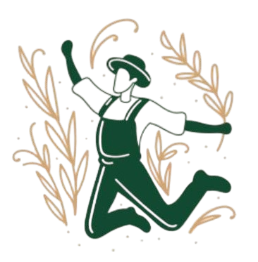

<div align="center">



# Farmio

### 🌾 智能農地租用平台 | AI-Powered Agricultural Land Rental Platform

*運用人工智慧技術，重新定義農業資源共享與永續發展*

</div>

<div align="center">


</div>

## 專案簡介

Farmio是一個創新的農地租用平台，透過創新的租地方式與AI技術提升農地使用效率，促進農業資源的永續發展。

### 核心價值

- **世代媒合**：讓年輕人能夠有更多的意願去務農
- **即時諮詢**：使用現今熱門模型提供農業諮詢服務
- **資源優化**：提升農地利用率，減少閒置資源
- **永續發展**：促進農業資源的有效循環與可持續利用

---

## 功能特色

### 農地租賃
- **我要租地**：瀏覽可租賃農地，查看詳細資訊與地理位置
- **我要出租**：透過表單輕鬆刊登農地出租資訊
- **智慧搜尋**：根據地區、面積、價格等條件篩選

### AI 農業小助手
- **即時對話**：支援繁體中文的 AI 聊天機器人
- **專業諮詢**：農地管理、作物種植、農具使用等專業建議
- **歷史記憶**：保留對話脈絡，提供連貫的諮詢體驗

### 社群互動
- **討論區**：農民交流經驗與心得
- **知識庫**：彙整農業相關知識與技術文章

### 企業合作
- 企業資訊整合與合作方案

---

## 技術架構

### 後端技術棧

```
Python 3.11+          - 程式語言
FastAPI 0.104.1       - Web 框架
Uvicorn 0.24.0        - ASGI 服務器
Pydantic 2.5.0        - 數據驗證
HTTPX 0.25.2          - 非同步 HTTP 客戶端
Python-dotenv 1.0.0   - 環境變數管理
```

### 前端技術棧

```
TypeScript 5.8.3      - 類型安全
React 18.3.1          - UI 框架
Vite 5.4.19           - 構建工具
TailwindCSS 3.4.17    - 樣式框架
Shadcn/UI             - 元件庫
React Router 6.30.1   - 路由管理
React Query 5.83.0    - 數據狀態管理
Lucide React 0.462.0  - 圖標庫
```

### AI 技術

```
Ollama                - 本地 LLM 運行環境
Qwen2:latest          - 阿里巴巴千問大語言模型
```

---

## 快速開始

### 系統需求

- **Node.js** >= 18.0.0
- **Python** >= 3.11
- **Ollama** (用於 AI 功能)

### 安裝步驟

#### 1. 克隆專案

```bash
git clone https://github.com/mato1321/Farmio.git
cd Farmio
```

#### 2. 安裝前端依賴

```bash
npm install
```

#### 3. 安裝 Ollama 與 AI 模型

```bash
ollama pull qwen2:latest
ollama serve
```

#### 4. 設定後端環境

```bash
cd backend
python -m venv venv
pip install -r requirements.txt

# 啟動虛擬環境
# Windows
venv\Scripts\activate
# macOS/Linux
source venv/bin/activate

# 建立環境變數檔案
cp .env.example .env
```

編輯 `.env` 檔案：

```env
OLLAMA_BASE_URL=http://localhost:11434
OLLAMA_MODEL=qwen2:latest
API_HOST=0.0.0.0
API_PORT=8000
```

#### 5. 啟動服務

**Ollama 服務**
```bash
ollama serve
```

**後端**
```bash
cd backend
python run.py
```

**前端**
```bash
uvicorn app.main:app --reload --host 0.0.0.0 --port 8000
```
---

## 專案結構

```
Farmio/
├── src/                      # 前端源碼
│   ├── components/           # React 元件
│   │   ├── Hero.tsx         # 主畫面英雄區塊
│   │   ├── Header.tsx       # 頁首導航
│   │   ├── Footer.tsx       # 頁尾
│   │   ├── FloatingButtons.tsx  # AI 助手浮動按鈕
│   │   └── ui/              # Shadcn UI 元件
│   ├── pages/               # 頁面組件
│   │   ├── Index.tsx        # 首頁
│   │   ├── Farmland.tsx     # 農地列表
│   │   ├── Member.tsx       # 會員中心
│   │   └── Forum.tsx        # 討論區
│   ├── App.tsx              # 應用主入口
│   └── main.tsx             # React 入口
│
├── backend/                  # 後端源碼
│   ├── app/
│   │   ├── main.py          # FastAPI 應用主程式
│   │   ├── config.py        # 配置管理
│   │   ├── api/             # API 路由
│   │   │   └── routes/
│   │   │       └── chat.py  # AI 聊天 API
│   │   ├── services/        # 業務邏輯
│   │   │   └── ollama.py    # Ollama 服務整合
│   │   └── schemas/         # Pydantic 數據模型
│   │       └── chat.py      # 聊天相關模型
│   ├── requirements.txt     # Python 依賴
│   └── run.py              # 啟動腳本
│
├── public/                  # 靜態資源
├── package.json            # 前端依賴配置
├── tsconfig.json           # TypeScript 配置
├── tailwind.config.ts      # TailwindCSS 配置
├── vite.config.ts          # Vite 配置
└── README.md               # 專案說明文件
```

---

## 團隊

- **開發者**: [@mato1321](https://github.com/mato1321)

---

## 聯絡我們

如有任何問題或建議，歡迎透過以下方式聯絡：

- GitHub Issues: [提交問題](https://github.com/mato1321/Farmio/issues)
- Email: charleskao811@gmail.com

---

<div align="center">

**Made with ❤️ by Farmio Team**

</div>